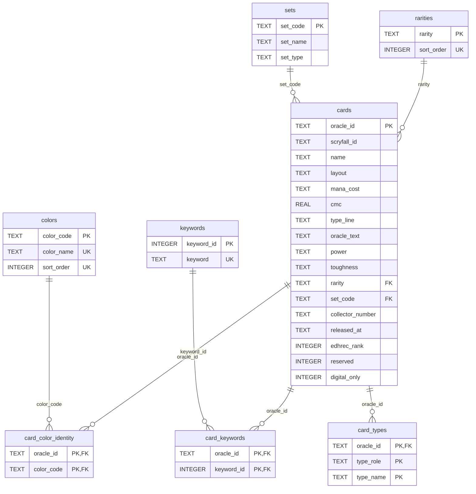

# Entity-relationship diagram

Generated from [schema.sql](../schema.sql) by `make_er_diagram.py`; re-run it after any schema change.

```mermaid
erDiagram
    colors ||--o{ card_color_identity : "color_code"
    cards ||--o{ card_color_identity : "oracle_id"
    keywords ||--o{ card_keywords : "keyword_id"
    cards ||--o{ card_keywords : "oracle_id"
    cards ||--o{ card_types : "oracle_id"
    sets ||--o{ cards : "set_code"
    rarities ||--o{ cards : "rarity"

    card_color_identity {
        TEXT oracle_id PK, FK
        TEXT color_code PK, FK
    }
    card_keywords {
        TEXT oracle_id PK, FK
        INTEGER keyword_id PK, FK
    }
    card_types {
        TEXT oracle_id PK, FK
        TEXT type_role PK
        TEXT type_name PK
    }
    cards {
        TEXT oracle_id PK
        TEXT scryfall_id
        TEXT name
        TEXT layout
        TEXT mana_cost
        REAL cmc
        TEXT type_line
        TEXT oracle_text
        TEXT power
        TEXT toughness
        TEXT rarity FK
        TEXT set_code FK
        TEXT collector_number
        TEXT released_at
        INTEGER edhrec_rank
        INTEGER reserved
        INTEGER digital_only
    }
    colors {
        TEXT color_code PK
        TEXT color_name UK
        INTEGER sort_order UK
    }
    keywords {
        INTEGER keyword_id PK
        TEXT keyword UK
    }
    rarities {
        TEXT rarity PK
        INTEGER sort_order UK
    }
    sets {
        TEXT set_code PK
        TEXT set_name
        TEXT set_type
    }
```
